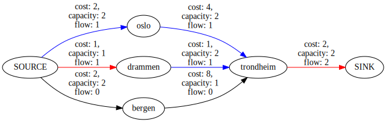
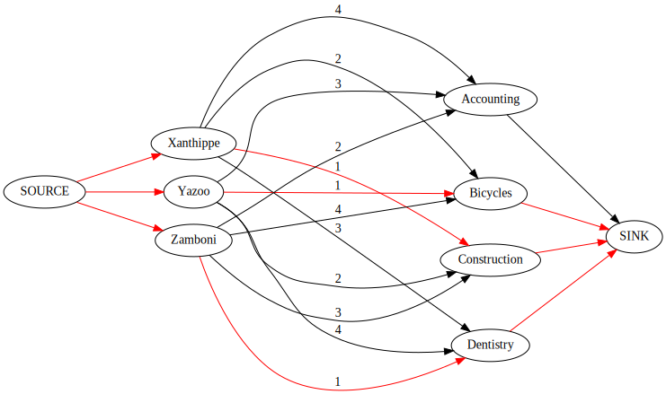

[](https://www.npmjs.org/package/min-cost-flow)

# min-cost-flow

<!-- prettier-ignore-start -->

<!-- toc -->

- [Minimum-cost flow problems](#minimum-cost-flow-problems)
- [Solving assignment problems using minimum-cost flow](#solving-assignment-problems-using-minimum-cost-flow)
- [Usage](#usage)
- [Types](#types)
- [Functions](#functions)
- [minCostFlow(graph, options) ⇒ Array.&lt;Required.&lt;Edge.&lt;string&gt;&gt;&gt;](#mincostflowgraph-options-%E2%87%92-arrayltrequiredltedgeltstringgtgtgt)
- [minCostFlowForNumberNodes(graph, desiredFlow) ⇒ Array.&lt;Required.&lt;Edge&gt;&gt;](#mincostflowfornumbernodesgraph-desiredflow-%E2%87%92-arrayltrequiredltedgegtgt)
- [cheapestPaths(adjacency, capacity, cost) ⇒ Object](#cheapestpathsadjacency-capacity-cost-%E2%87%92-object)
- [destringifyGraph(graph, options) ⇒ Array](#destringifygraphgraph-options-%E2%87%92-array)
- [restringifyGraph(graph, nodeNames) ⇒ Array.&lt;Edge.&lt;string&gt;&gt;](#restringifygraphgraph-nodenames-%E2%87%92-arrayltedgeltstringgtgt)

<!-- tocstop -->

<!-- prettier-ignore-stop -->

A package that solves [minimum-cost flow problems](https://en.wikipedia.org/wiki/Minimum-cost_flow_problem) using the
Successive Shortest Paths algorithm.

## Minimum-cost flow problems

Minimum-cost flow problems are all about sending given number of units (or as many units as possible) through a
[_flow network_](https://en.wikipedia.org/wiki/Flow_network):

> In graph theory, a **flow network** (also known as a **transportation network**) is a directed graph where each edge
> has a **capacity** and each edge receives a flow. The amount of flow on an edge cannot exceed the capacity of the
> edge. … A flow must satisfy the restriction that the amount of flow into a node equals the amount of flow out of it,
> unless it is a **source**, which has only outgoing flow, or **sink**, which has only incoming flow. A network can be
> used to model traffic in a computer network, circulation with demands, fluids in pipes, currents in an electrical
> circuit, or anything similar in which something travels through a network of nodes.

In a **_cost_ flow network**, we add the requirement all edges have a cost associated with sending one unit of flow
through it. If an edge's cost is 4, sending 1 unit costs 4, sending 2 units costs 8, and so on.

Below is an illustration of the solution to a flow problem in a network of Norwegian cities.

- The network has a total flow of 2 units, limited by the edge from `trondheim` to `SINK`.
- The cheapest route from from `SOURCE` to `trondheim` goes through `drammen`, but is limited by the edge from `SOURCE`
  to `drammen`. Therefore, one unit has to pass through the more expensive route via `oslo`. Bergen is even
- Edge color explanation
- Red indicates max flow (flow is equal to capacity)
- Blue indicates some flow, but not maximum
- Black edges have no flow



## Solving assignment problems using minimum-cost flow

For those employed outside of plumbing, shipping and electronics, minimum-cost flow will probably be most useful as a
way to match people to a limited number of resources in a way that gives the greatest overall satisfaction. This is
known as the [_assignment problem_](https://en.wikipedia.org/wiki/Assignment_problem):

> Suppose that a taxi firm has three taxis (the agents) available, and three customers (the tasks) wishing to be picked
> up as soon as possible. The firm prides itself on speedy pickups, so for each taxi the "cost" of picking up a
> particular customer will depend on the time taken for the taxi to reach the pickup point. This is a _balanced_
> assignment problem. Its solution is whichever combination of taxis and customers results in the least total cost.
>
> Now, suppose that there are four taxis available, but still only three customers. This is an _unbalanced_ assignment
> problem.

An assignment problem such as this can be considered a graph problem, more specifically _minimum-weight bipartite
matching_ problem (bipartite meaning that the nodes in the graph fall into two separate groups with all edges going
between those two groups, and no edges within the groups). A minimum-weight bipartite matching problem can easily be
solved by converting it to a minimum-cost flow problem.

Below, you will find an illustration of the taxi example as the graph `G`. The nodes in group `A` are the taxis, and the
nodes in group `B` are customers. `G` is bipartite, because it would be silly to have a taxi pick up a taxi. An edge
goes from a taxi to a customer if there's any chance that the taxi can reach the customer, and the edge's weight is
equal to the number of minutes before the taxi reaches the customer. The goal is to pick up all customers and achieve
the lowest overall weight.

Let us say that the overall weight is lowest if the first, third and fourth taxis pick up the first, second and third
customer respectively. To the right of `G`, you will find the graph `G'`, which shows how the assignment problem should
be converted to a minimum-cost flow-problem by treating the edges' weights as costs.


_[Minimum weight bipartite matching](https://en.wikipedia.org/wiki/File:Minimum_weight_bipartite_matching.pdf), CC-BY
3.0 Arash.nouri_

To take another example, let's say you have a class with three students: Xanthippe, Yazoo and Zamboni. For their
school's work week, there are four jobs to choose from, and the students get to rank them in order of preference.

|           | Accountant | Bicycle repairhuman | Construction worker | Dental assistant |
| --------- | ---------- | ------------------- | ------------------- | ---------------- |
| Xanthippe | 4          | 2                   | 1                   | 3                |
| Yazoo     | 3          | 1                   | 2                   | 4                |
| Zamboni   | 2          | 4                   | 3                   | 1                |

Let's say that a student's disappointment with getting a job is proportional to the rank they gave the job, e.g.
Xanthippe will be four times more disappointed with working as an accountant than as a construction worker. The problem
then becomes one of minimum weight bipartite matching: Match the students with jobs so that the disappointment is the
lowest. This can be solved by formulating the problem as a cost flow network.

The picture below shows how the problem of assigning these students has been converted to a cost flow network along with
its solution (which is a disappointment to the accounting bureau, but a relief to the students, who all got their first
choice).

- As with the taxi problem, the only
- If an edge is labelled, its cost is equal to its label, otherwise it's 0.
- All edges have a capacity equal to 1.
- If an edge is red, its flow is 1, otherwise it's 0.



## Usage

See [the tests](test/index.test.ts) for examples of networks and how to solve them.

## Types

This package exports one type, which contains all the data necessary to formulate a cost-flow

```typescript
export type Edge<T = number | string> = {
  from: T;
  to: T;
  capacity: number;
  cost: number;
  flow?: number;
};
```

## Functions

<dl>
<dt><a href="#minCostFlow">minCostFlow(graph, options)</a> ⇒ <code>Array.&lt;Required.&lt;Edge.&lt;string&gt;&gt;&gt;</code></dt>
<dd><p>Solves a minimum-cost flow problem using the successive shortest paths algorithm. Assumes that only one edge goes
between any two nodes – in either direction. In other words: no double edges in the same direction, and no back
edges.</p>
<p>The function is a wrapper that destringifies the graph, calls minCostFlowForNumberNodes on it and restringifies the
result.</p></dd>
<dt><a href="#minCostFlowForNumberNodes">minCostFlowForNumberNodes(graph, desiredFlow)</a> ⇒ <code>Array.&lt;Required.&lt;Edge&gt;&gt;</code></dt>
<dd><p>The underlying implementation of the successive shortest paths algorithm, nabbed from <a href="https:%5C/%5C/cp-algorithms.com/graph/min_cost_flow.html">https://cp-algorithms.com/graph/min_cost_flow.html</a></p>
<p>Assumptions:</p>
<ul>
<li>The nodes are sequentially numbered integers from 0 to (but not including) n.</li>
<li>Node 0 is the source, node n-1 is the sink.</li>
<li>Only one edge goes between any two nodes – in either direction. In other words: no double edges in the same direction, and no back edges.</li>
</ul></dd>
<dt><a href="#cheapestPaths">cheapestPaths(adjacency, capacity, cost)</a> ⇒ <code>Object</code></dt>
<dd><p>The Bellman-Ford shortest path algorithm as shown in <a href="https:%5C/%5C/cp-algorithms.com/graph/min_cost_flow.html">https://cp-algorithms.com/graph/min_cost_flow.html</a>.
Calculates the chepaest path from the source to every other node in the network as well as which node is the best predecessor of every node.</p></dd>
<dt><a href="#destringifyGraph">destringifyGraph(graph, options)</a> ⇒ <code>Array</code></dt>
<dd><p>Takes a graph with edges edges going to and from nodes with string names and transforms it into a graph with numbered edges,
following the convention that the source node is the first node and the sink node the last.
It assumes that the source node's name is SOURCE and the sink node's name is SINK.</p></dd>
<dt><a href="#restringifyGraph">restringifyGraph(graph, nodeNames)</a> ⇒ <code>Array.&lt;Edge.&lt;string&gt;&gt;</code></dt>
<dd><p>Restringifies a graph that has been destringified by destringifyGraph</p></dd>
</dl>

<a name="minCostFlow"></a>

## minCostFlow(graph, options) ⇒ <code>Array.&lt;Required.&lt;Edge.&lt;string&gt;&gt;&gt;</code>

<p>Solves a minimum-cost flow problem using the successive shortest paths algorithm. Assumes that only one edge goes
between any two nodes – in either direction. In other words: no double edges in the same direction, and no back
edges.</p>
<p>The function is a wrapper that destringifies the graph, calls minCostFlowForNumberNodes on it and restringifies the
result.</p>

**Kind**: global function

| Param   | Type                                           | Description                                                                                                                                                                                                                                                                                   |
| ------- | ---------------------------------------------- | --------------------------------------------------------------------------------------------------------------------------------------------------------------------------------------------------------------------------------------------------------------------------------------------- |
| graph   | <code>Array.&lt;Edge.&lt;string&gt;&gt;</code> | <p>The graph represented as an edge list</p>                                                                                                                                                                                                                                                  |
| options | <code>MinCostFlowOptions</code>                | <p>An object with three keys: source (string), sink (string) and desiredFlow (number). Source is <code>&quot;SOURCE&quot;</code> by default, sink is <code>&quot;SINK&quot;</code> by default and desiredFlow is <code>Infinity</code> by default (indicating a desire for maximum flow).</p> |

<a name="minCostFlowForNumberNodes"></a>

## minCostFlowForNumberNodes(graph, desiredFlow) ⇒ <code>Array.&lt;Required.&lt;Edge&gt;&gt;</code>

<p>The underlying implementation of the successive shortest paths algorithm, nabbed from <a href="https:%5C/%5C/cp-algorithms.com/graph/min_cost_flow.html">https://cp-algorithms.com/graph/min_cost_flow.html</a></p>
<p>Assumptions:</p>
<ul>
<li>The nodes are sequentially numbered integers from 0 to (but not including) n.</li>
<li>Node 0 is the source, node n-1 is the sink.</li>
<li>Only one edge goes between any two nodes – in either direction. In other words: no double edges in the same direction, and no back edges.</li>
</ul>

**Kind**: global function  
**Returns**: <code>Array.&lt;Required.&lt;Edge&gt;&gt;</code> - <p>The network updated to provide as much flow up to the
limit specified by desiredFlow</p>

| Param       | Type                                           | Description                                                                                                                                   |
| ----------- | ---------------------------------------------- | --------------------------------------------------------------------------------------------------------------------------------------------- |
| graph       | <code>Array.&lt;Edge.&lt;number&gt;&gt;</code> | <p>The graph represented as an edge list</p>                                                                                                  |
| desiredFlow | <code>number</code>                            | <p>The maximum flow you want; the algorithm stops when it reaches this number. Default is Infinity, indicating a desire for maximum flow.</p> |

<a name="cheapestPaths"></a>

## cheapestPaths(adjacency, capacity, cost) ⇒ <code>Object</code>

<p>The Bellman-Ford shortest path algorithm as shown in <a href="https:%5C/%5C/cp-algorithms.com/graph/min_cost_flow.html">https://cp-algorithms.com/graph/min_cost_flow.html</a>.
Calculates the chepaest path from the source to every other node in the network as well as which node is the best predecessor of every node.</p>

**Kind**: global function  
**Returns**: <code>Object</code> - <p>An object with type <code>{leastCosts: number[], predecessors: number[]}</code>.
The element at index <code>x</code> in each of these arrays contains the least cost of going to and the best
predecessors for node <code>x</code> respectively.</p>

| Param     | Type                                            | Description                                                                                                                                                                                                       |
| --------- | ----------------------------------------------- | ----------------------------------------------------------------------------------------------------------------------------------------------------------------------------------------------------------------- |
| adjacency | <code>Array.&lt;Array.&lt;number&gt;&gt;</code> | <p>. I.e., if adjacency[0] === [1, 4, 6], nodes 1, 4 and 6 are adjacent to 0.</p>                                                                                                                                 |
| capacity  | <code>Array.&lt;Array.&lt;number&gt;&gt;</code> | <p>A two dimensional array (size n\*n, where n is the number of nodes) describing the capacity going from each node to any other. capacity[x][y] describes the capacity from node x to node y.</p>                |
| cost      | <code>Array.&lt;Array.&lt;number&gt;&gt;</code> | <p>A two dimensional array (size n\*n, where n is the number of nodes) describing the cost of transporting one unit of flow from each node to any other. cost[x][y] describes the cost from node x to node y.</p> |

<a name="destringifyGraph"></a>

## destringifyGraph(graph, options) ⇒ <code>Array</code>

<p>Takes a graph with edges edges going to and from nodes with string names and transforms it into a graph with numbered edges,
following the convention that the source node is the first node and the sink node the last.
It assumes that the source node's name is SOURCE and the sink node's name is SINK.</p>

**Kind**: global function  
**Returns**: <code>Array</code> - <p>A two element tuple whose first element is the destringified graph and whose second
element is the node names listed in the order in which they were named, so that the graph can be restringified by
getting nodeNames[n] for any node in the destringified graph.</p>

| Param   | Type                                           | Description                                                                                                                                                                               |
| ------- | ---------------------------------------------- | ----------------------------------------------------------------------------------------------------------------------------------------------------------------------------------------- |
| graph   | <code>Array.&lt;Edge.&lt;string&gt;&gt;</code> | <p>A graph in the form of an edge list</p>                                                                                                                                                |
| options | <code>Object</code>                            | <p>An object with two (optional) keys: source and sink. If a value is supplied at this key, the function will assume that the source/sink node's name is equal to the supplied value.</p> |

<a name="restringifyGraph"></a>

## restringifyGraph(graph, nodeNames) ⇒ <code>Array.&lt;Edge.&lt;string&gt;&gt;</code>

<p>Restringifies a graph that has been destringified by destringifyGraph</p>

**Kind**: global function  
**Returns**: <code>Array.&lt;Edge.&lt;string&gt;&gt;</code> - <p>The restringified graph</p>

| Param     | Type                                           | Description                                                                                                                   |
| --------- | ---------------------------------------------- | ----------------------------------------------------------------------------------------------------------------------------- |
| graph     | <code>Array.&lt;Edge.&lt;number&gt;&gt;</code> | <p>The graph as an edge list</p>                                                                                              |
| nodeNames | <code>Array.&lt;string&gt;</code>              | <p>The names of each node, so that the name of the node numbered <code>x</code> can be found at <code>nodeNames[x]</code></p> |
